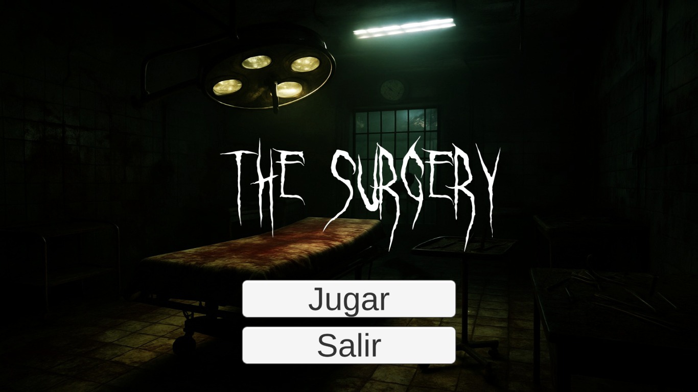
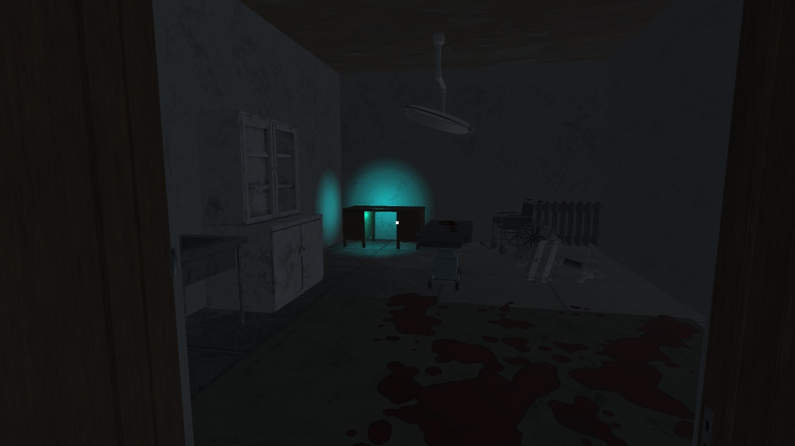
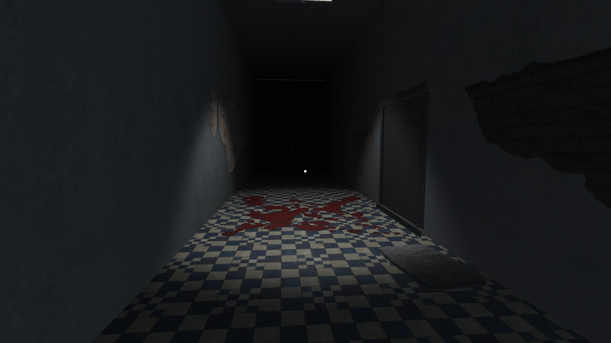
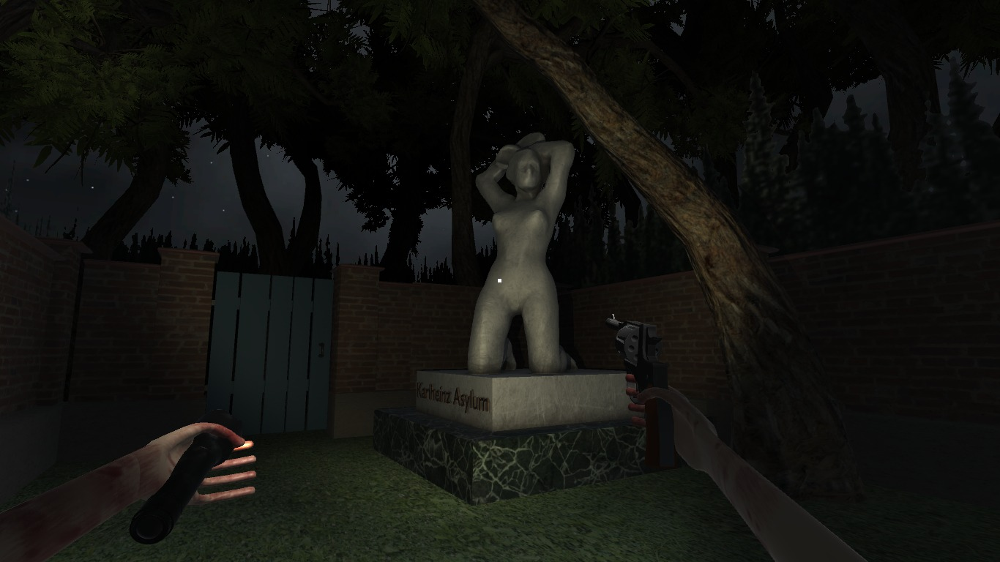
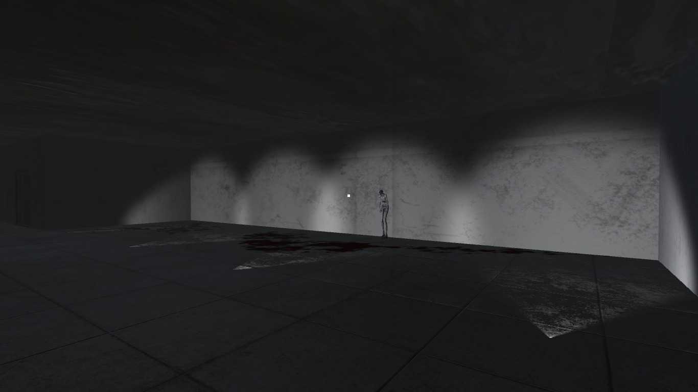
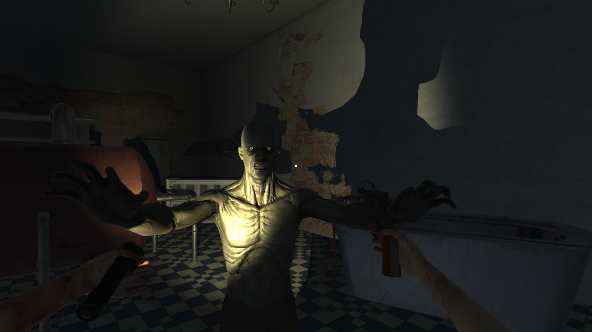

# The Surgery

Playable game prototype developed in Unity.

## Description

This project is a small game prototype where the player navigates through an environment while interacting with different elements of the scene.
The project was developed to explore gameplay mechanics, level flow, UI design, and basic game systems using Unity and C#.

## Features

* Gameplay mechanics implemented with C#
* Level and scene management
* UI and menu system
* Character animations
* Environment interaction

## Technologies

* Unity
* C#
*  Visual Studio Code

## Screenshots

### Menú Principal

### Gameplay

### Enemigos

## Notes

Some large third-party assets were excluded from this repository to reduce its size.
